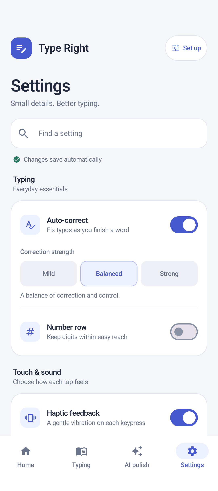
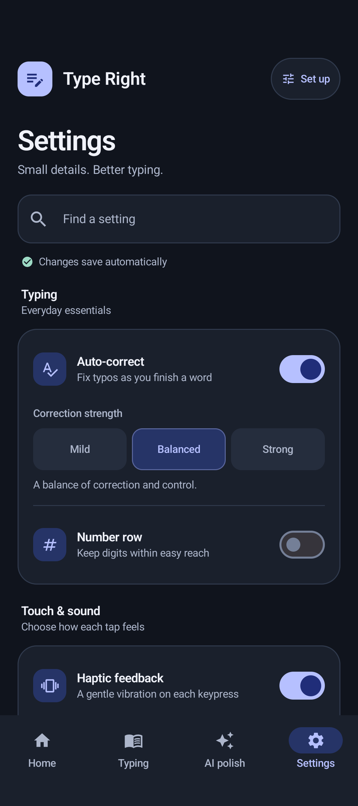
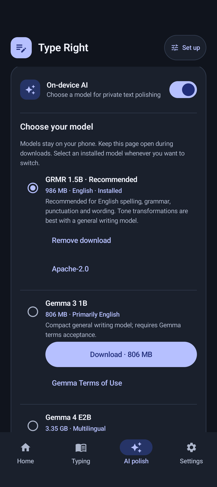

# Companion app settings

The companion app opens on Settings, with persistent navigation to Home, Typing,
AI polish, and Settings. The redesign is scoped to the companion activity; the
keyboard layout, IME theme, and prediction engine are unchanged by the companion
app design. Subsequent Gemma 4 and voice updates are documented in
[local model setup](LOCAL_GGUF.md) and [voice input](VOICE_INPUT.md).

- Searchable groups for typing, touch and sound, appearance, dictionary, and AI.
- Consistent cards, spacing, typography, full-row switches, and light, dark, and
  midnight palettes. Controls continue to write the existing saved preferences.
- A focused personal dictionary screen with word and shortcut entry first.
- Clear on-device AI setup, model status, model license, language selection, and
  a draft playground using the existing backend.
- Search and page state survive tab navigation and activity recreation. Back
  returns to Settings, and incoming tab shortcuts work with an open activity.

## Preview

| Light | Dark |
| --- | --- |
|  |  |

The AI page uses the same card layout with a persistent GRMR/Gemma model picker,
per-model download size, installation status, cancellation, removal and licenses.
Compatible custom GGUF downloads can be added by URL and checksum:



## Verification

`gradlew.bat :app:testDebugUnitTest :app:assembleDebug :app:assembleDebugAndroidTest`
runs the unit suite and builds both APKs. `AppSettingsUiTest` covers saved settings and search
after recreation, tab state and Back, incoming tab shortcuts, and all three
theme choices. The theme test also passes at 320 dp width with 1.3 font scaling.
Screenshots were captured from the running Compose UI on an Android 16 emulator.

To run the companion UI checks on a connected Android device:

```sh
./gradlew :app:connectedDebugAndroidTest -Pandroid.testInstrumentationRunnerArguments.class=com.example.AppSettingsUiTest
```

`ModelSettingsUiTest` additionally verifies all three model choices, saved selection
after recreation, Gemma 3 consent and invalid custom download URL handling.
