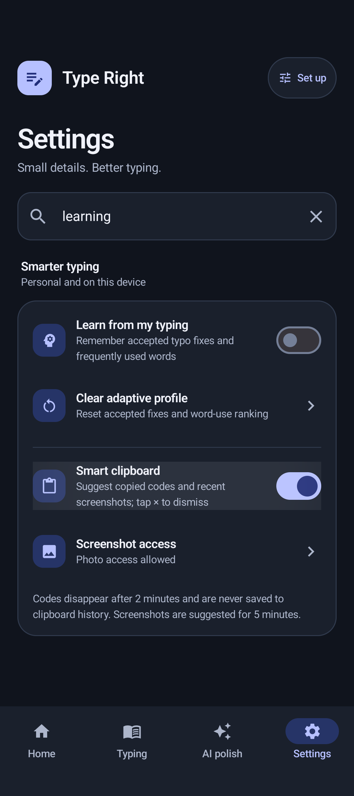

# Adaptive typing and smart clipboard

## Accepted polish

A successful tap on an AI writing-result card (or a rephrase suggestion) teaches small word-level typo fixes. Generating, previewing, cancelling, stale editor snapshots, and failed editor commits do not train the profile. The automatic direct-proofread path does not train accepted-edit corrections.

A bounded token alignment tolerates inserted/deleted words. Only single-word edits with at most two character edits, including transpositions, and a small relative edit distance are learned. The replacement must be a known dictionary word. Numbers, URLs, email addresses, large rewrites, and unknown replacement names are excluded. Real-word changes require three acceptances with the same preceding one or two words; they never become global replacements. Conflicting replacements need a dominant repeated choice. Personal dictionary words, blocked words, and rejected corrections remain protected.

An undo/revert removes the correction observation from that acceptance and restores only the replaced text. It refuses to overwrite subsequent typing or another editor. Rejecting an autocorrection also removes the corresponding learned mapping.

## Personal usage and typing patterns

Committed words feed a bounded profile of word frequencies and one-/two-word transitions. The profile contributes to next-word prediction, prefix suggestion ranking, and immediate typo-candidate scoring. Valid words and unfinished prefixes keep the existing preservation rules. Existing local touch-offset and swipe-template learning continues to adapt to the user's physical typing patterns.

The profile stores up to 2,000 words, 4,000 transitions, and 500 correction pairs, with capped counts and recency eviction. Reads use cached data; debounced persistence runs on a background writer without holding the typing lock during disk writes. It survives app/process restarts. This new profile is excluded from cloud backup and device transfer.

Passwords, URLs, email inputs, numeric inputs, and fields with `IME_FLAG_NO_PERSONALIZED_LEARNING` do not train it. **Settings → Smarter typing → Learn from my typing** disables further learning and use of the new personal ranking/correction profile. **Clear adaptive profile** removes accepted fixes and usage counts; manually managed dictionary words remain available.

Swipe decoding and committing both normalize words to lowercase. Automatic sentence shift does not title-case glide words. Explicit caps lock produces uppercase words, and ordinary tapped-key capitalization is unchanged.

## Smart clipboard

When enabled, the suggestion toolbar automatically displays copied OTP codes and recent screenshots while the current word is empty. Each chip has its own close control. Dismissal also survives reopening the keyboard; a new copy/screenshot gets a new identity. Pasting a suggestion dismisses it after a successful commit. Suggestions are not shown in password/sensitive fields.

- **Codes:** Standalone 4–8 digit codes or one unambiguous number near a verification-code/OTP marker. Leading zeroes are preserved. Ambiguous codes, phone numbers, decimal prices, and ordinary order numbers are not offered. Suggestions expire two minutes after copying (on Android 24–25, which do not expose the copy timestamp, after first observation by the keyboard). Newly captured OTP text is not inserted into clipboard history. Clipboard items flagged sensitive by their source app are not read into suggestions/history. Codes come from copied text; the feature does not read SMS messages or notifications.
- **Screenshots:** PNG, JPEG, or WebP media in the Screenshots folder or with a Screenshot filename, created in the last five minutes. Up to two are shown with thumbnails. **Settings → Smarter typing → Screenshot access** invokes Android's photo permission prompt only after a user tap. Full or limited selected-photo access is supported; with limited access only accessible screenshots can appear. Permissions are rechecked when the keyboard starts/refreshes. Screenshots are observed while the keyboard is visible, with periodic expiry checks.
- **Image paste:** The receiving editor must advertise a compatible image MIME type. On an explicit tap, a size-limited copy (20 MB) is made in the existing app cache FileProvider and committed with temporary read access. A stale editor/session is checked again after the copy. Unsupported editors get an explanatory message. Prepared screenshot cache files older than 24 hours are removed on a later paste. Original gallery images are never modified.

Only hashes identifying dismissed suggestions are stored, with a limit of 64. Those dismissal preferences are excluded from backup/transfer. Disabling **Smart clipboard** stops automatic suggestions; Android photo access remains user-controlled in system settings.

## Android design references

The image commit follows Android's [image keyboard](https://developer.android.com/develop/ui/views/touch-and-input/image-keyboard) protocol and [InputConnectionCompat](https://developer.android.com/reference/androidx/core/view/inputmethod/InputConnectionCompat) MIME/read-grant requirements. Media discovery follows [shared media access](https://developer.android.com/training/data-storage/shared/media) and [Android 14 selected-photo access](https://developer.android.com/about/versions/14/changes/partial-photo-video-access). Sensitive clipboard handling follows [Android clipboard guidance](https://developer.android.com/privacy-and-security/risks/secure-clipboard-handling).

## Verification

Unit tests cover acceptance, editor failure/staleness, undo/rejection, persistence, conflicting replacements, protected contexts, usage ranking, lower-case swipes, OTP extraction/expiry/history exclusion, and editor MIME negotiation. Instrumented tests exercise live clipboard changes, per-chip paste/dismissal, screenshot discovery/expiry/dismissal, FileProvider PNG reads, image read grants, and settings persistence/reset. Verified on 3 October 2026:

- `gradlew.bat testDebugUnitTest assembleDebug assembleDebugAndroidTest`: **142 unit tests passed**, debug APK and instrumented APK built for ARM64/x86_64.
- Pixel 9 emulator, Android 16/API 36: **13 unique instrumented tests passed** across SmartClipboardInstrumentedTest (3), AppSettingsUiTest (5), VoiceInputToolbarTest (2), and ModelSettingsUiTest (3). The existing Gemma 3 download-consent test requires an absent-model fixture; the emulator's installed Gemma 3 file was temporarily renamed for that check and restored afterward. No model bytes were changed.
- Screenshot fixture discovery, expiry/dismissal, generated PNG reads through FileProvider, and image read-grant/MIME negotiation were exercised using Android's real media APIs. Live clipboard updates and sensitive-clip exclusion were exercised on-device. Settings were visually inspected after capture.

